# Timeline Visualizations (时间线可视化)

**Purpose**: 可视化呈现2017-2025年大语言模型发展历程
**Created**: 2025-10-17
**Format**: Mermaid diagrams

---

## 1. 总体时间线 (Overall Timeline) 2017-2025

```mermaid
%%{init: {'theme':'base', 'themeVariables': {'primaryColor':'#ff6b6b','primaryTextColor':'#fff','primaryBorderColor':'#ff6b6b','lineColor':'#4ecdc4','secondaryColor':'#45b7d1','tertiaryColor':'#96ceb4'}}}%%
timeline
    title 大语言模型发展历程 (2017-2025)

    section 2017-2018 基础奠定
        2017-06: Transformer论文发表 (Google Brain)
        2018-06: GPT-1发布 (OpenAI)
        2018-10: BERT发布 (Google)

    section 2019-2020 规模化探索
        2019-02: GPT-2发布与争议 (OpenAI)
        2019-10: T5统一框架 (Google)
        2020-05: GPT-3突破175B参数 (OpenAI)

    section 2021-2022 走向对齐
        2021-03: GPT-3 API开放 (OpenAI)
        2021-09: DALL-E多模态 (OpenAI)
        2022-03: InstructGPT与RLHF (OpenAI)
        2022-11: ChatGPT现象级发布 (OpenAI)

    section 2023 全球AI竞赛
        2023-02: LLaMA开源革命 (Meta)
        2023-02: Bing整合ChatGPT (Microsoft)
        2023-03: GPT-4多模态 (OpenAI)
        2023-03: 文心一言首发 (百度)
        2023-03: Claude安全对齐 (Anthropic)
        2023-04: 盘古行业模型 (华为)
        2023-06: Claude 2超长上下文 (Anthropic)
        2023-06: ChatGLM2开源 (智谱)
        2023-07: LLaMA 2商业开源 (Meta)
        2023-08: 豆包内测 (字节)
        2023-09: 混元发布 (腾讯)

    section 2024 多模态与推理突破
        2024-01: DeepSeek-V2 MoE架构 (DeepSeek)
        2024-02: Gemini 1.5超长上下文 (Google)
        2024-02: Sora视频生成 (OpenAI)
        2024-03: Claude 3挑战GPT-4 (Anthropic)
        2024-03: Blackwell算力升级 (Nvidia)
        2024-04: Qwen1.5开源标杆 (阿里)
        2024-05: GPT-4o原生多模态 (OpenAI)
        2024-07: Llama 3.1 405B (Meta)
        2024-08: GLM-4全面升级 (智谱)
        2024-09: o1推理突破 (OpenAI)
        2024-11: Grok-2发布 (xAI)
        2024-12: Gemini 2.0 Agent时代 (Google)

    section 2025 中美并驾齐驱
        2025-01: DeepSeek-V3效率突破 (DeepSeek)
        2025-02: 文心4.0技术成熟 (百度)
        2025-06: 混元3.0生态整合 (腾讯)
        2025-09: Claude 3.5编程领先 (Anthropic)
        2025-10: 豆包推理增强 (字节)
```

---

## 2. 中美AI竞赛时间线 (US-China AI Competition)

```mermaid
%%{init: {'theme':'base', 'themeVariables': {'primaryColor':'#003d82','secondaryColor':'#de2910'}}}%%
timeline
    title 中美AI竞赛演进 (US-China AI Race)

    section 第一阶段: 美国主导 (2017-2022)
        美国领先: Google Transformer架构开创新时代
              : OpenAI GPT系列快速迭代
              : ChatGPT引爆全球AI热潮
        中国跟随: 处于学习和跟随阶段
              : 基础研究积累

    section 第二阶段: 中国追赶 (2023)
        美国持续: GPT-4多模态突破
              : Microsoft-OpenAI生态整合
        中国爆发: 文心一言3.5个月快速响应
              : 百模大战全面爆发
              : 智谱开源策略降低门槛
              : 阿里腾讯华为字节全面进入

    section 第三阶段: 并驾齐驱 (2024-2025)
        美国创新: OpenAI o1推理突破
              : GPT-4o原生多模态
              : Anthropic安全对齐领先
        中国创新: DeepSeek MoE架构创新全球领先
              : 阿里Qwen开源生态全球认可
              : 算法优化弥补硬件差距
              : 中文理解和推理效率优势
        共同目标: 双方共同奔向AGI
```

---

## 3. 开源vs闭源之争 (Open vs Closed Source)

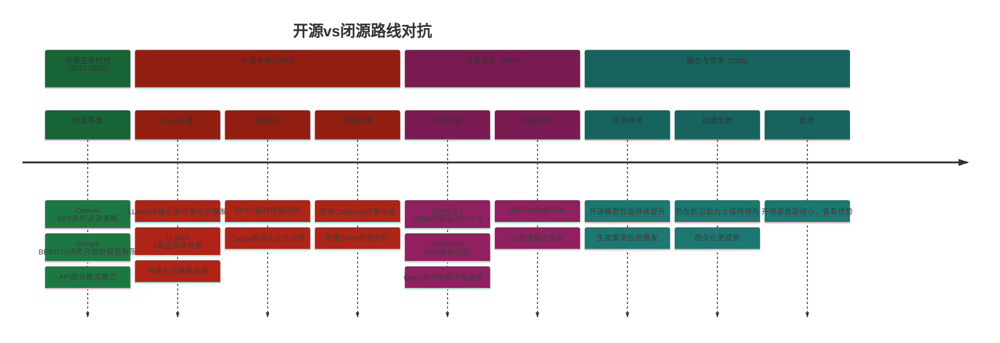

---

## 4. 芯片战与算力竞争 (Chip War & Computing Power)

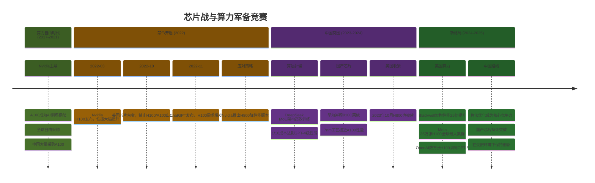

---

## 5. 技术范式演进 (Technical Paradigm Evolution)

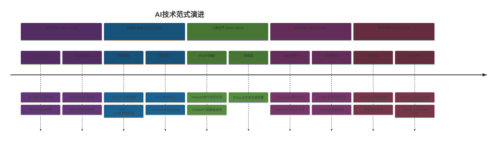

---

## 6. 主要公司发展时间线 (Major Companies Timeline)

### OpenAI时间线

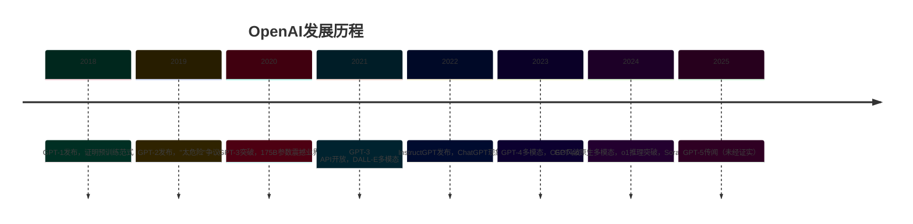

### Google/DeepMind时间线

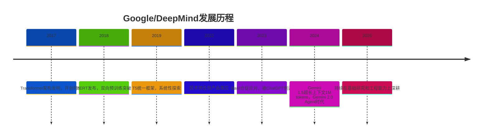

### Meta时间线

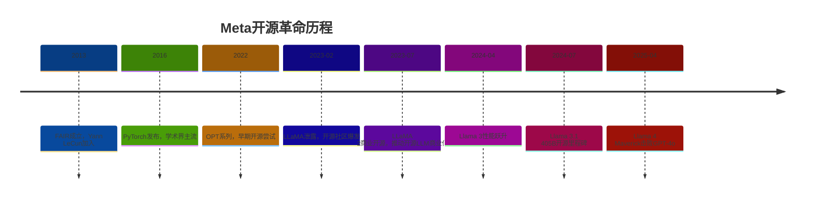

### Anthropic时间线

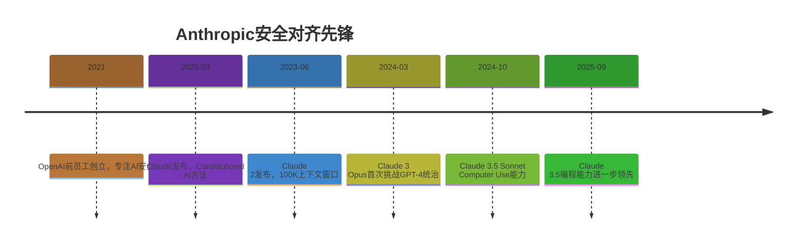

### 中国公司时间线（百度、阿里、智谱、DeepSeek）

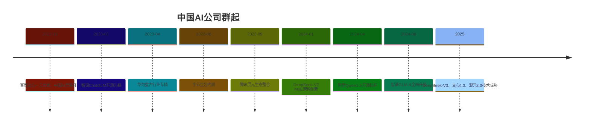

---

## 7. 关键里程碑节点 (Key Milestones)

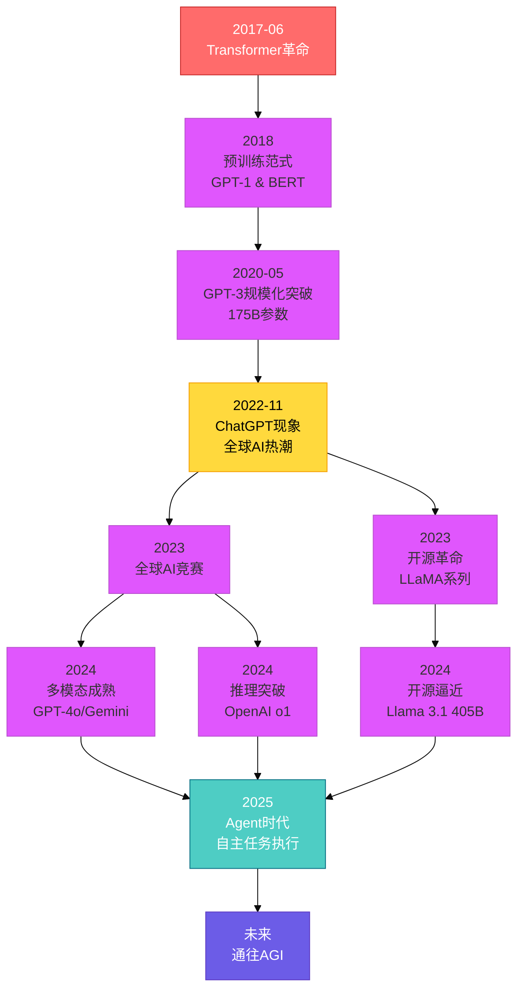

---

## 8. 参数规模演进 (Parameter Scale Evolution)

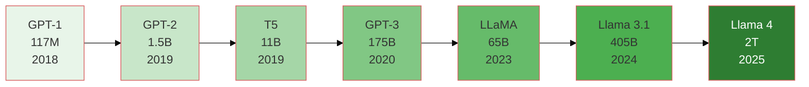

---

## 9. 上下文窗口演进 (Context Window Evolution)

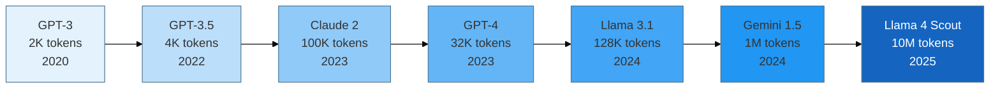

---

## 使用说明 (Usage Notes)

1. **Mermaid语法**: 这些图表使用Mermaid语法编写，可在支持Mermaid的Markdown查看器中渲染
2. **在线查看**: 可使用[Mermaid Live Editor](https://mermaid.live)在线预览和编辑
3. **集成工具**: GitHub、GitLab、Notion、Obsidian等工具原生支持Mermaid渲染
4. **导出图片**: 可通过Mermaid CLI或在线工具导出为PNG/SVG格式

---

**Created**: 2025-10-17
**Last Updated**: 2025-10-17
**Total Diagrams**: 9个主要时间线可视化
