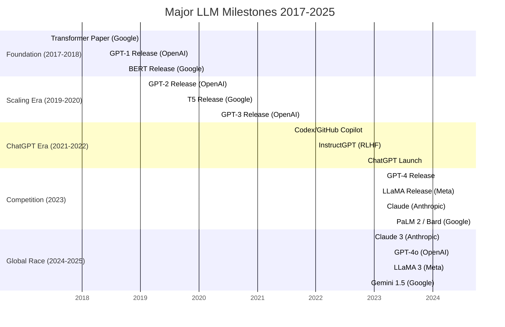
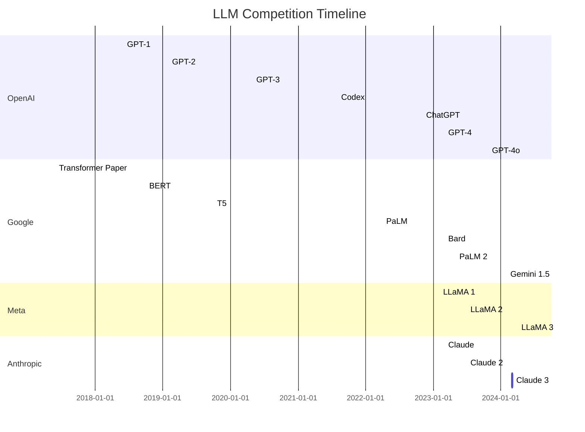

# Timeline Visualization Contract

**Version**: 1.0
**Purpose**: Standard formats for timeline diagrams and event representations
**Applies To**: Files in `assets/timelines/` directory and timeline sections in chapters

---

## Overview

Timeline visualizations serve three purposes:
1. **Comprehensive Overview**: Full timeline showing all major events 2017-2025
2. **Company Comparisons**: Parallel tracks showing competitive developments
3. **Chapter Context**: Mini-timelines introducing each chapter's period

---

## Format 1: Mermaid Gantt Chart (Primary)

**Use For**: Overall timeline, company comparison timelines, period overviews

### Basic Syntax

```mermaid
gantt
    title [Timeline Title]
    dateFormat YYYY-MM
    axisFormat %Y-%m

    section [Category Name]
    [Event Name]    :[Event Type], [Start Date], [Duration or End Date]
```

### Overall Timeline Example

**File**: `assets/timelines/overall-timeline.md`

````markdown
# LLM Development Timeline: 2017-2025

Complete chronological overview of major Large Language Model developments.



**Legend**:
- 🔴 Critical milestones (red, `crit` tag)
- 🔵 Major releases (blue, `active` tag)
- ⚪ Notable events (default)
````

### Company Comparison Timeline

**File**: `assets/timelines/company-timelines/comparison.md`

````markdown
# Company Development Timeline: OpenAI vs Google vs Meta


````

### Mermaid Best Practices

**Date Format**:
- Use `YYYY-MM` for month precision
- Use `YYYY-MM-DD` for day precision
- Duration: `1d` for point-in-time events, `Xd` for ongoing

**Categories**:
- Use `crit` for critical milestones (renders in red)
- Use `active` for major releases (renders in blue)
- Default for notable events (renders in gray)

**Section Names**:
- Organizations: "OpenAI", "Google", "Meta", etc.
- Themes: "Foundation", "Scaling Era", "Competition"
- Periods: "2017-2018", "2023-2024"

---

## Format 2: Markdown Table (Alternative)

**Use For**: Dense chronological listings, when Mermaid is too visual

### Standard Table Format

```markdown
| Date | Organization | Event | Significance | Chapter |
|------|-------------|-------|--------------|---------|
| 2017-06 | Google Brain | Transformer Paper | 🔴 Critical | 1 |
| 2018-06 | OpenAI | GPT-1 Release | 🔵 Major | 2 |
| 2018-10 | Google | BERT Release | 🔵 Major | 2 |
| 2019-02 | OpenAI | GPT-2 Release | 🔵 Major | 3 |
| 2020-05 | OpenAI | GPT-3 Release | 🔴 Critical | 3 |
| 2022-11 | OpenAI | ChatGPT Launch | 🔴 Critical | 6 |
| 2023-03 | OpenAI | GPT-4 Release | 🔴 Critical | 7 |
```

**Significance Levels**:
- 🔴 Critical: Paradigm-shifting events (Transformer, GPT-3, ChatGPT, GPT-4)
- 🔵 Major: Significant releases (BERT, GPT-2, Claude, LLaMA)
- ⚪ Notable: Important but incremental (updates, variants)

### Compact Table (Space-Constrained)

```markdown
| Date | Event | Org |
|------|-------|-----|
| 2017-06 | Transformer 🔴 | Google |
| 2018-06 | GPT-1 | OpenAI |
| 2018-10 | BERT | Google |
| 2022-11 | ChatGPT 🔴 | OpenAI |
| 2023-03 | GPT-4 🔴 | OpenAI |
```

---

## Format 3: ASCII Timeline (Simple)

**Use For**: Chapter introductions, simple period overviews

### Linear ASCII Format

```
2017 ────●─────────────────────── Transformer (Google)
         |
2018 ────●──────●──────────────── GPT-1 (OpenAI) │ BERT (Google)
         |      |
2019 ────●──────●──────────────── GPT-2 (OpenAI) │ T5 (Google)
         |
2020 ────●─────────────────────── GPT-3 (OpenAI) ⭐
         |
2021 ────●─────────────────────── Codex (OpenAI)
         |
2022 ────●─────────────────────── ChatGPT (OpenAI) ⭐⭐
         |
2023 ────●──●──●────────────────── GPT-4 (OpenAI) ⭐ │ LLaMA (Meta) │ Claude (Anthropic)
```

### Branching ASCII Format

```
              ┌─ GPT-1 (2018-06)
              │   ├─ GPT-2 (2019-02)
Transformer ──┤   └─ GPT-3 (2020-05)
(2017-06)     │       └─ ChatGPT (2022-11)
              │           └─ GPT-4 (2023-03)
              │
              ├─ BERT (2018-10)
              │   └─ RoBERTa, ALBERT...
              │
              └─ T5 (2019-10)
                  └─ PaLM (2022-04)
```

---

## Format 4: Event Cards (Detailed)

**Use For**: Individual event documentation in `assets/timelines/events/`

### Event Card Template

**File**: `assets/timelines/events/{event-id}.md`

```markdown
---
event_id: transformer-paper-2017
date: 2017-06-12
title: "《Attention is All You Need》论文发表"
title_en: "Attention is All You Need Paper Published"
organization: google-brain
event_type: paper_publication
significance_level: critical
verification_status: highly_verified
sources:
  - vaswani2017
  - arxiv-1706-03762
---

# Event: Attention is All You Need Paper Published

**Date**: June 12, 2017
**Organization**: Google Brain
**Event Type**: 📄 Paper Publication
**Significance**: 🔴 Critical Milestone

## Summary

Google Brain团队发表了具有里程碑意义的论文"Attention is All You Need"，提出了Transformer架构...

[2-3 paragraphs description]

## Key Innovations

- **Self-Attention Mechanism**: 允许模型同时关注序列中的所有位置
- **Parallel Processing**: 摒弃循环结构，实现完全并行化训练
- **Positional Encoding**: 引入位置编码保留序列顺序信息

## Impact & Consequences

这一架构成为现代大型语言模型的基础，直接影响了：

**Immediate Impact** (2017-2018):
- GPT-1 (OpenAI, 2018-06): 采用Transformer decoder
- BERT (Google, 2018-10): 采用Transformer encoder

**Long-term Impact** (2018+):
- 所有现代LLM (GPT系列, BERT系列, T5, PaLM等) 都基于Transformer
- 成为自然语言处理的标准架构
- 启发了视觉Transformer (ViT) 等跨领域应用

## Technical Details

**Architecture Components**:
- Multi-Head Attention: 8 attention heads
- Feed-Forward Networks: 2-layer MLP
- Layer Normalization & Residual Connections

**Training**:
- Dataset: WMT English-German translation task
- Parameters: ~65M (base model), ~213M (large model)
- Hardware: 8 NVIDIA P100 GPUs

## Causal Connections

**Enabled By**:
- Attention mechanisms in sequence-to-sequence models
- Residual connections research

**Enabled**:
- GPT-1 (2018-06)
- BERT (2018-10)
- T5 (2019-10)
- All subsequent transformer-based models

## Verification

**Status**: ✅ Highly Verified

**Sources**:
- Vaswani, A., et al. (2017). Attention is All You Need. *NeurIPS 2017*. https://arxiv.org/abs/1706.03762
- Official Google AI Blog announcement
- Widely cited in academic literature (50,000+ citations)

## Related Content

**Chapter**: [Chapter 1: Transformer Revolution](../../manuscript/01-foundation/transformer-revolution.md)
**Technical Concepts**: [Self-Attention](../concepts/self-attention.md), [Positional Encoding](../concepts/positional-encoding.md)
**Organization**: [Google Brain Profile](../../research/organizations/google-brain.md)
```

---

## Visualization Guidelines

### When to Use Which Format

| Use Case | Recommended Format | Rationale |
|----------|-------------------|-----------|
| Comprehensive overview (50+ events) | Mermaid Gantt | Visual, shows timing relationships |
| Company comparison | Mermaid Gantt (multi-section) | Parallel tracks show competition |
| Dense event listing | Markdown Table | Sortable, filterable, searchable |
| Chapter introduction | ASCII Timeline | Simple, lightweight, fits inline |
| Individual event detail | Event Card | Comprehensive single-event documentation |
| Period overview (5-10 events) | ASCII or Mermaid | Depends on space and context |

### Design Principles

**Clarity**:
- Maximum 7-10 events per view before grouping/filtering
- Clear date labels (YYYY-MM or YYYY-MM-DD)
- Descriptive event names (avoid acronyms without context)

**Consistency**:
- Same significance markers across all formats (🔴🔵⚪)
- Consistent date formatting (YYYY-MM or YYYY-MM-DD)
- Standardized organization names (OpenAI, not "Open AI" or "open ai")

**Accessibility**:
- Symbols + text labels (not symbols alone)
- High contrast colors for Mermaid diagrams
- Text alternatives for visual timelines

---

## Validation Rules

**Timeline Completeness** (SC-002, SC-006):
- [ ] At least 50 significant events documented (2017-2025)
- [ ] At least one comprehensive timeline visualization exists
- [ ] All critical milestones (🔴) appear in main timeline

**Event Documentation**:
- [ ] Every event has date, organization, title
- [ ] Significance level assigned (critical/major/notable)
- [ ] Verification status documented
- [ ] Sources cited

**Chronological Accuracy**:
- [ ] Events in correct date order
- [ ] No duplicate events with different dates
- [ ] Dates match cited sources

**Causal Relationships** (FR-016):
- [ ] "Enabled by" and "Enabled" connections documented
- [ ] Causal graph is directed acyclic (no circular causality)
- [ ] Key innovations linked to subsequent developments

---

## File Organization

```
assets/timelines/
├── overall-timeline.md              # Main comprehensive timeline
├── company-timelines/
│   ├── comparison.md                # Multi-company comparison
│   ├── openai-timeline.md           # OpenAI-specific
│   ├── google-timeline.md           # Google-specific
│   ├── meta-timeline.md             # Meta-specific
│   └── chinese-companies.md         # Baidu, Alibaba, etc.
├── technical-milestones.md          # Technology-focused view
└── events/
    ├── transformer-paper-2017.md    # Individual event cards
    ├── gpt1-release-2018.md
    ├── bert-release-2018.md
    └── [... 50+ event files]
```

---

## Update Process

**Adding New Events**:
1. Create event card in `assets/timelines/events/{event-id}.md`
2. Update overall timeline (Mermaid gantt)
3. Update relevant company timeline
4. Add to period table if applicable
5. Update causal connections in related events

**Quarterly Review**:
- Verify all URLs still accessible
- Update "Last Updated" date in frontmatter
- Check for new events in covered period
- Validate chronological order

---

## Common Patterns

### Chapter Timeline Introduction

**Pattern**: Start each chapter with mini-timeline of covered period

```markdown
# Chapter 3: The Scaling Era (2019-2020)

## Timeline: 2019-2020 Major Developments

```
2019 ────●──────●──────●────────── GPT-2 (OpenAI, Feb) │ XLNet (Google, Jun) │ T5 (Google, Oct)
         |
2020 ────●─────────────────────── GPT-3 (OpenAI, May) ⭐⭐
```

This period saw the scaling hypothesis confirmed: larger models with more data produced better performance...
```

### Cross-Chapter Timeline References

**Pattern**: Link to full timeline for context

```markdown
GPT-3的发布（参见[完整时间线](../../assets/timelines/overall-timeline.md)）标志着...
GPT-3's release (see [full timeline](../../assets/timelines/overall-timeline.md)) marked...
```

---

## Version History

**v1.0** (2025-10-17): Initial timeline visualization contract
