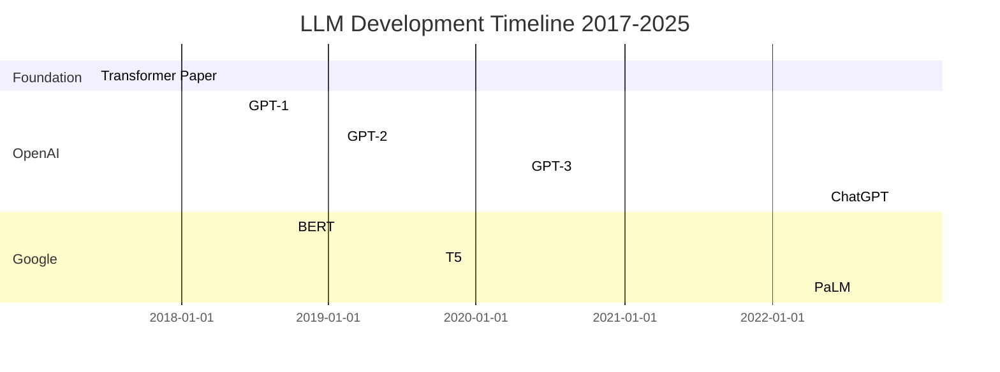

# Research & Technical Decisions: LLM History Chronicle Book

**Feature**: LLM History Chronicle Book
**Branch**: `001-llm-history-chronicle`
**Date**: 2025-10-17
**Purpose**: Resolve all NEEDS CLARIFICATION items from plan.md Technical Context

---

## 1. Research Management Tools

### Decision
**Selected Approach**: Git-based Markdown workflow with directory structure organization

### Rationale
- **Version Control**: Git provides complete history tracking, branching for major revisions, and collaboration support
- **Simplicity**: Directory-based organization (research/sources/, research/fact-checking/) keeps materials organized without additional tooling
- **Markdown Native**: All research notes stay in Markdown format, consistent with manuscript
- **Zero Additional Dependencies**: No external tools required beyond Git and text editor
- **Scalability**: Handles 50+ sources easily through file system organization

### Implementation Approach
```
research/
├── sources/
│   ├── papers/           # Academic papers (by year/topic)
│   ├── articles/         # Blog posts, news articles
│   └── interviews/       # Primary source interviews/talks
└── fact-checking/
    ├── verified-events.md      # Confirmed facts with sources
    ├── disputed-claims.md      # Conflicting information
    └── verification-log.md     # Fact-checking process notes
```

### Alternatives Considered
- **Notion/Obsidian**: Rejected - introduces external dependency, harder to version control, potential vendor lock-in
- **Zettlekasten Tools**: Rejected - unnecessary complexity for linear chronological narrative
- **Database**: Rejected - overkill for static content, harder to maintain

---

## 2. Citation Management

### Decision
**Format**: Informal inline citations with full bibliography
**Tool**: Manual Markdown management (no external tools)
**Style**: Author-Year format with numbered references section

### Rationale
- **Accessibility**: Informal inline style (Author, Year) is reader-friendly for popular science/history format
- **Simplicity**: Manual management sufficient for ~100-200 sources, avoids tool complexity
- **Markdown Compatibility**: Plain text citations integrate seamlessly without special syntax
- **Bilingual Support**: Handles both Chinese and English sources naturally in plain text
- **Flexibility**: Easy to adjust citation style without tool constraints

### Implementation Format

**Inline Citation Examples**:
```markdown
The Transformer architecture (Vaswani et al., 2017) introduced the self-attention mechanism...

According to OpenAI's blog post (Radford, 2018), GPT-1 was trained on...

据百度研究院发布的报告 (李彦宏，2019)，ERNIE模型...
```

**Bibliography Section** (at end of book):
```markdown
## References

### Academic Papers
- Vaswani, A., Shazeer, N., Parmar, N., et al. (2017). Attention is All You Need. *NeurIPS 2017*. https://arxiv.org/abs/1706.03762

### Company Publications
- Radford, A., Narasimhan, K., Salimans, T., & Sutskever, I. (2018). Improving Language Understanding by Generative Pre-Training. *OpenAI Blog*. https://openai.com/research/...

### Chinese Sources
- 李彦宏 (2019). 《ERNIE技术白皮书》. 百度研究院. https://...
```

### Alternatives Considered
- **BibTeX/LaTeX**: Rejected - adds complexity, not Markdown-native, unnecessary for non-academic audience
- **Zotero**: Rejected - external tool dependency, export workflow friction
- **IEEE/APA Formal**: Rejected - too formal for popular science narrative style

---

## 3. Timeline Visualization Tools

### Decision
**Primary Format**: Mermaid diagrams (Markdown-compatible)
**Secondary Format**: ASCII/text-based timelines for simple sequences
**Fallback**: Markdown tables for event listings

### Rationale
- **Mermaid**: Widely supported in Markdown renderers (GitHub, GitLab, many static site generators)
- **Text-Based**: All formats remain plain text, version controllable, no binary assets
- **Flexibility**: Multiple formats for different visualization needs (gantt charts, flowcharts, tables)
- **Multi-Track Support**: Mermaid gantt charts naturally support parallel company development tracks
- **Zero Build Dependencies**: Renders client-side in most modern Markdown viewers

### Implementation Examples

**Overall Timeline (Mermaid Gantt)**:


**Company Comparison Timeline (Markdown Table)**:
```markdown
| Date | OpenAI | Google | Meta | Anthropic | Baidu | Alibaba |
|------|--------|--------|------|-----------|-------|---------|
| 2017-06 | - | - | - | - | - | - |
| 2017-12 | Transformer Paper (Google) | Transformer | - | - | - | - |
| 2018-06 | GPT-1 | - | - | - | - | - |
| 2018-10 | - | BERT | - | - | - | - |
```

**Simple ASCII Timeline** (for chapter introductions):
```
2017 ----[Transformer]
2018 ----[GPT-1]----[BERT]
2019 ----[GPT-2]----[T5]
2020 ----[GPT-3]
2021 ----[Codex]
2022 ----[ChatGPT]----[PaLM]
```

### Alternatives Considered
- **SVG/PNG Images**: Rejected - binary files, not version-control friendly, harder to maintain
- **PlantUML**: Rejected - less widely supported than Mermaid
- **Custom Timeline Generator**: Rejected - unnecessary tooling complexity

---

## 4. Fact Verification Methodology

### Decision
**Multi-Source Triangulation** with documented verification status

### Rationale
- **Reliability**: Cross-referencing multiple sources reduces single-source error
- **Transparency**: Clear documentation of verification status builds reader trust
- **Practical**: Balances thoroughness with feasibility for 50+ events
- **Flexible**: Handles both well-documented and disputed facts

### Verification Process

**Level 1 - Highly Verified (3+ independent sources)**:
- Multiple academic papers, official announcements, and reputable news sources agree
- Mark: ✅ [Verified: Source A, Source B, Source C]

**Level 2 - Verified (2 independent sources)**:
- Two reliable sources confirm the same information
- Mark: ✓ [Confirmed: Source A, Source B]

**Level 3 - Single Source (1 source)**:
- Only one source available, but source is authoritative (e.g., official announcement)
- Mark: [Source: Official Company Blog]

**Level 4 - Reported/Rumored (unverified)**:
- Industry reports, insider accounts, but not officially confirmed
- Mark: ⚠️ [Reported: Source A; unconfirmed]

**Level 5 - Disputed (conflicting sources)**:
- Multiple sources give different dates, details, or accounts
- Mark: ⚠️ [Disputed: Source A says X, Source B says Y]

### Fact-Checking Documentation

**verified-events.md** format:
```markdown
## Event: ChatGPT Launch
- **Date**: November 30, 2022
- **Status**: ✅ Highly Verified
- **Sources**:
  1. OpenAI Official Blog: https://openai.com/blog/chatgpt
  2. TechCrunch Coverage: https://...
  3. OpenAI Twitter Announcement: https://...
- **Key Details**: Free research preview, based on GPT-3.5 with RLHF
```

**disputed-claims.md** format:
```markdown
## Disputed: GPT-4 Training Data Cutoff
- **Claim**: Training data cutoff is September 2021
- **Source A** (OpenAI): "Knowledge cutoff: September 2021" (technical report)
- **Source B** (Industry speculation): Some reports suggest partial 2022 data
- **Resolution**: Use official OpenAI statement, note speculation exists
- **Book Treatment**: "According to OpenAI's technical report, GPT-4's knowledge cutoff is September 2021"
```

### Alternatives Considered
- **Formal Academic Peer Review**: Rejected - impractical for popular book timeline, overly rigorous
- **Single-Source Acceptance**: Rejected - too low verification standard, risks misinformation
- **Every Fact Triple-Verified**: Rejected - impractical for 50+ events within reasonable timeframe

---

## 5. Readability Testing Approach

### Decision
**Multi-Stage Beta Reader Program** with targeted feedback collection

### Rationale
- **Audience Alignment**: Beta readers from target demographic (technical professionals, AI enthusiasts)
- **Iterative Improvement**: Multiple review stages catch different issue types
- **Practical Feedback**: Specific questions guide readers to useful feedback
- **Technical Validation**: Mix of technical and non-technical readers validates accessibility

### Beta Reader Program Structure

**Stage 1 - Technical Review (2-3 readers with ML background)**:
- **Goal**: Verify technical accuracy
- **Focus**: Check explanations of self-attention, scaling laws, RLHF, etc.
- **Timing**: After first draft of technical chapters complete
- **Questions**:
  - Are technical explanations accurate?
  - What's oversimplified to the point of misleading?
  - What concepts need more depth?

**Stage 2 - Accessibility Review (3-5 readers with basic tech literacy, no ML expertise)**:
- **Goal**: Validate explanations are understandable to target audience
- **Focus**: Can non-experts follow technical concepts?
- **Timing**: After technical review revisions complete
- **Questions**:
  - Can you explain [concept X] in your own words after reading?
  - Which sections were confusing?
  - Which analogies/examples were helpful vs. misleading?

**Stage 3 - Consistency Review (2-3 readers for full manuscript)**:
- **Goal**: Validate narrative flow, voice consistency, engagement
- **Focus**: Overall readability and coherence
- **Timing**: Complete draft ready
- **Questions**:
  - Does the narrative voice feel consistent across chapters?
  - Which sections dragged or felt repetitive?
  - Which anecdotes were most engaging?
  - Overall clarity rating: 1-5

### Consistency Validation Tools

**Automated Checks**:
- Terminology consistency: Search for term variations (e.g., "language model" vs "LLM" vs "大语言模型")
- Tone analysis: Review chapter openings/closings for consistent structure
- Citation format: Verify all citations follow (Author, Year) format

**Manual Review**:
- Read chapters in sequence to check flow and transitions
- Verify technical term definitions are introduced before use
- Check anecdote frequency distribution across chapters

### Metrics for Success
- Beta readers rate clarity 4/5 or higher (SC-010 from spec.md)
- 90% of technical terms explained on first use (SC-004 from spec.md)
- No contradictory explanations of same concept across chapters

### Alternatives Considered
- **No Beta Readers**: Rejected - too risky, no external validation before publication
- **Professional Editor Only**: Rejected - editors may lack technical expertise to validate LLM content
- **Large Beta Reader Pool (10+)**: Rejected - diminishing returns, coordination complexity

---

## 6. Content Organization Best Practices

### Decision
**Chronological Primary Structure** with thematic secondary organization within periods

### Rationale
- **Chronology Aligns With Spec**: FR-016 requires clear causal relationships (how one breakthrough enabled next)
- **Reader Navigation**: Timeline structure makes it easy to locate specific events (SC-009: find events within 30 seconds)
- **Thematic Depth**: Within chronological periods, group by themes (companies, technical concepts) for depth
- **Natural Flow**: LLM history naturally follows technology → product → competition narrative

### Chapter Length Standards

**Target**: 8,000-12,000 Chinese characters per chapter (~24-36 pages)

**Rationale**:
- Total: 100,000-150,000 characters / 10-12 major chapters = ~10,000 chars/chapter
- Readable in 20-30 minutes per chapter
- Sufficient depth for technical explanations + anecdotes
- Allows for variation (foundation chapters longer, recent updates shorter)

### Chronological Structure with Thematic Organization

**Part I: Foundation (2017-2018)**
- Ch 1: Transformer Revolution (Attention is All You Need)
- Ch 2: Early Applications (GPT-1, BERT)

**Part II: The GPT Era (2019-2020)**
- Ch 3: Scaling Up (GPT-2, GPT-3)
- Ch 4: Google's Response (T5, PaLM foundations)

**Part III: The Breakthrough (2021-2022)**
- Ch 5: RLHF Innovation
- Ch 6: ChatGPT Launch and Impact

**Part IV: Global Competition (2023-2024)**
- Ch 7: OpenAI vs Anthropic (GPT-4, Claude)
- Ch 8: Meta's Open Source Strategy (LLaMA)
- Ch 9: Chinese AI Development (Baidu ERNIE, Alibaba Qwen)

**Part V: Recent Developments (2024-2025)**
- Ch 10: Multimodal LLMs
- Ch 11: Current State (through October 2025)

### Cross-Referencing Strategy

**Forward References** (when mentioning future developments):
```markdown
这一突破为后来的ChatGPT奠定了基础（见第6章）。
[This breakthrough laid the foundation for ChatGPT (see Chapter 6).]
```

**Backward References** (when building on previous content):
```markdown
如第2章所述，BERT的双向架构已经展示了...
[As described in Chapter 2, BERT's bidirectional architecture had already demonstrated...]
```

**Technical Concept Links**:
```markdown
关于self-attention机制的详细解释，参见第1章。
[For a detailed explanation of the self-attention mechanism, see Chapter 1.]
```

**Glossary References**:
```markdown
RLHF^[1] 全称为Reinforcement Learning from Human Feedback（人类反馈强化学习，详见术语表）
[RLHF^[1] stands for Reinforcement Learning from Human Feedback (see Glossary)]
```

### Balance Between Chronological and Thematic

**Chronological Priority**:
- Main chapter sequence follows timeline
- Events presented in order they occurred
- Causal relationships emphasized

**Thematic Grouping Within Periods**:
- Within 2023-2024 period, group by company/organization
- Technical concepts explained when they first appear chronologically
- Anecdotes placed with related technical/company developments

### Alternatives Considered
- **Pure Chronological (Every Event Sequential)**: Rejected - too fragmented, loses thematic coherence
- **Thematic Primary (All OpenAI together, All Google together)**: Rejected - loses causal timeline, harder to see industry evolution
- **Hybrid Parallel Tracks**: Rejected - too complex to read, violates linear narrative preference

---

## Summary of Resolved Clarifications

All NEEDS CLARIFICATION items from plan.md Technical Context have been resolved:

| Item | Decision | Rationale |
|------|----------|-----------|
| **Research Management** | Git + directory structure | Simple, version controlled, no external tools |
| **Citation Management** | Manual Markdown (Author, Year) | Accessible, bilingual support, sufficient for scope |
| **Timeline Visualization** | Mermaid + ASCII + tables | Markdown-native, flexible, widely supported |
| **Fact Verification** | Multi-source triangulation | Balanced rigor, transparent verification status |
| **Readability Testing** | Multi-stage beta reader program | Target audience validation, iterative improvement |
| **Content Organization** | Chronological + thematic | Aligns with spec requirements, navigable structure |

**GATE STATUS**: ✅ All clarifications resolved. Ready for Phase 1 Design.

---

## Next Actions

1. ✅ Phase 0 Complete: All research questions answered
2. **→ Phase 1**: Generate data-model.md, contracts/, and quickstart.md
3. **→ Agent Context**: Update agent-specific context file
4. **→ Tasks**: Generate tasks.md via `/speckit.tasks`
